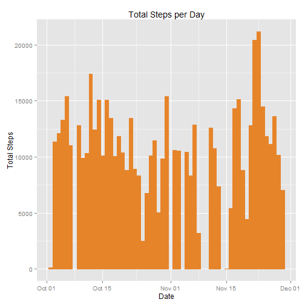
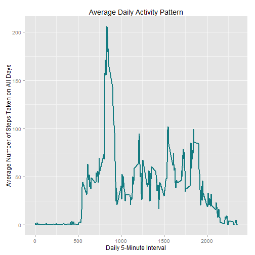
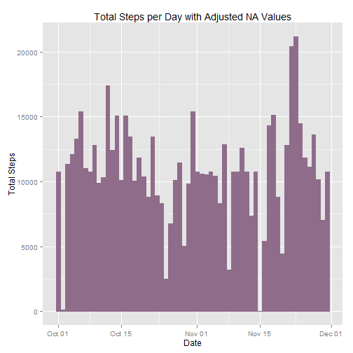
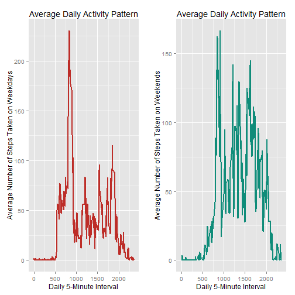

## Loading Data
Loading the data into R as a data frame. The data in the date column are coerced to the date class. The data in the steps and interval columns are coerced to the numeric class for easier use in further analysis.


```r
pa1.data <- read.csv("activity.csv", header = TRUE)
pa1.data[,1] <- as.numeric(pa1.data[,1])
pa1.data[,2] <- as.Date(pa1.data[,2], format = "%Y-%m-%d")
pa1.data[,3] <- as.numeric(pa1.data[,3])
```

## Average Total Steps Per Day
First, a variable is created determining which days have data.


```r
uniquedays <- unique(pa1.data[,2])
```

Next, using a loop, the total number of steps taken per day is calculated. This could likely be achieved using apply or an apply variant, but I have chosen to use a loop here out of familiarity.


```r
# stepsday.tot is a data frame to store the total number of steps per day
stepsday.tot <- data.frame(date = as.Date("1990-01-01", format = "%Y-%m-%d"), totalsteps = 0, stringsAsFactors = FALSE)

# tempbin is a temporary storage variable for ease of transfer to stepsday.tot
tempbin <- data.frame(date = as.Date("1990-01-01", format = "%Y-%m-%d"), totalsteps = 0, stringsAsFactors = FALSE)

# The main loop
for (i in 1:length(uniquedays)) {
        tempbin[1,1] <- uniquedays[i]
        tempbin[1,2] <- sum(subset(pa1.data, date == uniquedays[i], select = steps))
        stepsday.tot[i,] <- tempbin
}

# stepsday.tot.narm is very similar to stepsday.tot, but with NA values removed
stepsday.tot.narm <- na.omit(stepsday.tot)

# Clear the tempbin, i
remove(tempbin)
remove(i)
```

A histogram is generated, showing the total number of steps per day.


```r
library(ggplot2)

ggplot(stepsday.tot.narm, aes(x = date, y = totalsteps)) + 
        geom_histogram(colour = "#E6842A", fill = "#E6842A", stat = "identity") + 
        ggtitle("Total Steps per Day") + 
        xlab("Date") + 
        ylab("Total Steps")
```

 

Finally, a simple output of the mean and median total number of steps taken per day.


```r
stepsday.tot.mean <- mean(stepsday.tot[,2], na.rm = TRUE)
stepsday.tot.median <- median(stepsday.tot[,2], na.rm = TRUE)

print(paste("The mean total number of steps per day is... ", stepsday.tot.mean, sep = ""))
```

```
## [1] "The mean total number of steps per day is... 10766.1886792453"
```

```r
print(paste("The median total number of steps per day is... ", stepsday.tot.median, sep = ""))
```

```
## [1] "The median total number of steps per day is... 10765"
```

## Average Daily Activity Pattern
Now, I'll make a new data frame to store the average total steps in each day's 5-minute interval.


```r
# tmpa is temporary variabe
tmpa <- 0

# intrage is a loop counter, although it will generate extraneous results
intrange <- seq(from = 0, to = 2355, by = 5)

# stepsday.interval is a data frame to store average steps in each day's 5-minute interval
stepsday.interval <- data.frame(interval = 0, averagesteps = 0, stringsAsFactors = FALSE)

# tempbin is a temporary storage variable for ease of transfer to stepsday.interval
tempbin <- data.frame(interval = 0, averagesteps = 0, stringsAsFactors = FALSE)

# The main loop
for (k in intrange) {
        tmpa <- subset(pa1.data, interval == k)
        tempbin[1,1] <- k
        tempbin[1,2] <- mean(tmpa$steps, na.rm = TRUE)
        if (k == 0) {
                stepsday.interval[1,] <- tempbin
        } else if (k != 0) {
                stepsday.interval <- rbind(stepsday.interval, tempbin)
        }
}

# Remove extraneous results generated from intrange loop counter
stepsday.interval <- na.omit(stepsday.interval)

# Clear tmpa, intrange, tempbin, k
remove(tmpa)
remove(intrange)
remove(tempbin)
remove(k)
```

A time series (line) plot is created, with the 5-minute interval on the x-axis and the average number of steps taken across all available days on the y-axis.


```r
ggplot(stepsday.interval, aes(x = interval, y = averagesteps)) +
        geom_line(colour = "#137B80", size = 1, stat = "identity") +
        ggtitle("Average Daily Activity Pattern") +
        xlab("Daily 5-Minute Interval") +
        ylab("Average Number of Steps Taken on All Days")
```

 

Which 5-minute interval contains the highest average number of steps taken (across all days)?


```r
stepsday.interval.max <- subset(stepsday.interval, averagesteps == max(stepsday.interval[,2]))

print(paste("Interval ", stepsday.interval.max[1,1], " is the 5-minute interval with the highest average number of steps taken (across all days)", sep = ""))
```

```
## [1] "Interval 835 is the 5-minute interval with the highest average number of steps taken (across all days)"
```

## Missing Values
First, I'll have to calculate how many rows are missing data.


```r
tmpa <- is.na(pa1.data[,1])

print(paste("The number of rows with missing values (NA) is... ", sum(tmpa), sep = ""))
```

```
## [1] "The number of rows with missing values (NA) is... 2304"
```

```r
remove(tmpa)
```

I'm going to fill sections with missing data with the mean for that 5-minute interval.


```r
# pa1.data.naalt is similar to the main data frame pa1.data, but with NA values filled with the mean for the 5-minute interval
pa1.data.naalt <- pa1.data

# The main loop
for (p in 1:nrow(pa1.data.naalt)) {
        if (is.na(pa1.data.naalt[p,1])) {
                pa1.data.naalt[p,1] <- subset(stepsday.interval, interval == pa1.data.naalt[p,3], select = averagesteps)
        }
}

# Double check that there are no missing values in pa1.data.naalt (tmpa is a temporary variable)
tmpa <- is.na(pa1.data.naalt[,1])

if (sum(tmpa) == 0) {
        print("There are no missing values (NA) in pa1.data.naalt")
} else {
        print("ERROR:// There are missing values (NA) in pa1.data.naalt")
}
```

```
## [1] "There are no missing values (NA) in pa1.data.naalt"
```

```r
# Clear p, tmpa
remove(p)
remove(tmpa)
```

Let's make a new histogram, this time with average interval values instead of missing values. I also want to see the new adjusted mean and median number of total steps.


```r
# Recalculating the average total number of steps
# This section should be nearly identical to the section above, but with 5-minute interval means instead of NA values
stepsday.alt <- data.frame(date = as.Date("1990-01-01", format = "%Y-%m-%d"), totalsteps = 0, stringsAsFactors = FALSE)

tempbin <- data.frame(date = as.Date("1990-01-01", format = "%Y-%m-%d"), totalsteps = 0, stringsAsFactors = FALSE)

for (i in 1:length(uniquedays)) {
        tempbin[1,1] <- uniquedays[i]
        tempbin[1,2] <- sum(subset(pa1.data.naalt, date == uniquedays[i], select = steps))
        stepsday.alt[i,] <- tempbin
}

# Clear the tempbin, i
remove(tempbin)
remove(i)

# Creating the histogram
ggplot(stepsday.alt, aes(x = date, y = totalsteps)) + 
        geom_histogram(colour = "#8E6C8A", fill = "#8E6C8A", stat = "identity") + 
        ggtitle("Total Steps per Day with Adjusted NA Values") + 
        xlab("Date") + 
        ylab("Total Steps")
```

 

```r
# New adjusted mean and median total steps
stepsday.alt.mean <- mean(stepsday.alt[,2], na.rm = TRUE)
stepsday.alt.median <- median(stepsday.alt[,2], na.rm = TRUE)

print(paste("The mean total number of steps per day is... ", stepsday.alt.mean, sep = ""))
```

```
## [1] "The mean total number of steps per day is... 10766.1886792453"
```

```r
print(paste("The median total number of steps per day is... ", stepsday.alt.median, sep = ""))
```

```
## [1] "The median total number of steps per day is... 10766.1886792453"
```

### Differences After NA Adjustment
Is there a significant difference after adjusting missing values? As you can see on the graph, there is some obvious change. The majority of the difference appears to come from days that were completely missing data now have an average value. Days that already had data seem to have changed little.
<br><br>
The mean and median values are identical after NA adjustment. The pre-adjustment mean and post-adjustment mean are also identical. The only change has come from the median increasing after adjustment. Why is the median increasing? My instinctive assumption is that, after altering the missing values, the median is approaching the mean.

## Weekdays Versus Weekends
Here I am creating a new variable, tracking whether a particular day is a weekday or a weekend. I *know* this process can be done faster than using a loop, but I ran out of time to work out a different method.


```r
# Setting up the data for a "weekday/weekend" variable
pa1.data.wday <- pa1.data.naalt
pa1.data.wday$wtype <- "weekday"

weekends <- c("2012-10-06", "2012-10-07", "2012-10-13", "2012-10-14", "2012-10-20", "2012-10-21", "2012-10-27", "2012-10-28", "2012-11-03", "2012-11-04", "2012-11-10", "2012-11-11", "2012-11-17", "2012-11-18", "2012-11-24", "2012-11-25")
weekends <- as.Date(weekends, format = "%Y-%m-%d")

# The (awful) main loop
for (q in 1:nrow(pa1.data.wday)) {
        if(pa1.data.wday[q,2] == weekends[1]) {pa1.data.wday[q,4] <- "weekend"} else if(pa1.data.wday[q,2] == weekends[2]) {pa1.data.wday[q,4] <- "weekend"} else if(pa1.data.wday[q,2] == weekends[3]) {pa1.data.wday[q,4] <- "weekend"} else if(pa1.data.wday[q,2] == weekends[4]) {pa1.data.wday[q,4] <- "weekend"} else if(pa1.data.wday[q,2] == weekends[5]) {pa1.data.wday[q,4] <- "weekend"} else if(pa1.data.wday[q,2] == weekends[6]) {pa1.data.wday[q,4] <- "weekend"} else if(pa1.data.wday[q,2] == weekends[7]) {pa1.data.wday[q,4] <- "weekend"} else if(pa1.data.wday[q,2] == weekends[8]) {pa1.data.wday[q,4] <- "weekend"} else if(pa1.data.wday[q,2] == weekends[9]) {pa1.data.wday[q,4] <- "weekend"} else if(pa1.data.wday[q,2] == weekends[10]) {pa1.data.wday[q,4] <- "weekend"} else if(pa1.data.wday[q,2] == weekends[11]) {pa1.data.wday[q,4] <- "weekend"} else if(pa1.data.wday[q,2] == weekends[12]) {pa1.data.wday[q,4] <- "weekend"} else if(pa1.data.wday[q,2] == weekends[13]) {pa1.data.wday[q,4] <- "weekend"} else if(pa1.data.wday[q,2] == weekends[14]) {pa1.data.wday[q,4] <- "weekend"} else if(pa1.data.wday[q,2] == weekends[15]) {pa1.data.wday[q,4] <- "weekend"} else if(pa1.data.wday[q,2] == weekends[16]) {pa1.data.wday[q,4] <- "weekend"}
}

# Clear q
remove(q)
```

Next, it's time to recalculate the average number of steps for weekends and weekends.


```r
pa1.weekday <- subset(pa1.data.wday, wtype == "weekday")
pa1.weekend <- subset(pa1.data.wday, wtype == "weekend")

# Setup work, similar to previous "Average Daily Activity Pattern" section
tmpa <- 0
intrange <- seq(from = 0, to = 2355, by = 5)

stepsday.weekday <- data.frame(interval = 0, averagesteps = 0, stringsAsFactors = FALSE)
stepsday.weekend <- data.frame(interval = 0, averagesteps = 0, stringsAsFactors = FALSE)
tempbin <- data.frame(interval = 0, averagesteps = 0, stringsAsFactors = FALSE)

# The main loop(s)
for (m in intrange) {
        tmpa <- subset(pa1.weekday, interval == m)
        tempbin[1,1] <- m
        tempbin[1,2] <- mean(tmpa$steps, na.rm = TRUE)
        if (m == 0) {
                stepsday.weekday[1,] <- tempbin
        } else if (m != 0) {
                stepsday.weekday <- rbind(stepsday.weekday, tempbin)
        }
}

for (n in intrange) {
        tmpa <- subset(pa1.weekend, interval == n)
        tempbin[1,1] <- n
        tempbin[1,2] <- mean(tmpa$steps, na.rm = TRUE)
        if (n == 0) {
                stepsday.weekend[1,] <- tempbin
        } else if (n != 0) {
                stepsday.weekend <- rbind(stepsday.weekend, tempbin)
        }
}

# Remove extraneous results generated from intrange loop counter
stepsday.weekday <- na.omit(stepsday.weekday)
stepsday.weekend <- na.omit(stepsday.weekend)

# Clear tmpa, intrange, tempbin, m, n
remove(tmpa)
remove(intrange)
remove(tempbin)
remove(m)
remove(n)
```

Lastly, I create a time series (line) plot with data from weekdays and weekends.


```r
# Multiplot funciton, all credit due to Winston Chang
# R Cookbook, Winston Chang, http://www.cookbook-r.com/

library(grid)

        # Multiple plot function
        #
        # ggplot objects can be passed in ..., or to plotlist (as a list of        ggplot objects)
        # - cols:   Number of columns in layout
        # - layout: A matrix specifying the layout. If present, 'cols' is        ignored.
        #
        # If the layout is something like matrix(c(1,2,3,3), nrow=2, byrow       =TRUE),
        # then plot 1 will go in the upper left, 2 will go in the upper right, and
        # 3 will go all the way across the bottom.
multiplot <- function(..., plotlist=NULL, file, cols=1, layout=NULL) {
  require(grid)

  # Make a list from the ... arguments and plotlist
  plots <- c(list(...), plotlist)

  numPlots = length(plots)

  # If layout is NULL, then use 'cols' to determine layout
  if (is.null(layout)) {
    # Make the panel
    # ncol: Number of columns of plots
    # nrow: Number of rows needed, calculated from # of cols
    layout <- matrix(seq(1, cols * ceiling(numPlots/cols)),
                    ncol = cols, nrow = ceiling(numPlots/cols))
  }
  
  if (numPlots==1) {
    print(plots[[1]])
    
    } else {
    # Set up the page
    grid.newpage()
    pushViewport(viewport(layout = grid.layout(nrow(layout), ncol(layout))))

    # Make each plot, in the correct location
    for (i in 1:numPlots) {
      # Get the i,j matrix positions of the regions that contain this subplot
      matchidx <- as.data.frame(which(layout == i, arr.ind = TRUE))

      print(plots[[i]], vp = viewport(layout.pos.row = matchidx$row,
                                      layout.pos.col = matchidx$col))
    }
  }
}

# Plotting the final graphs
weekday.plot <-
        ggplot(stepsday.weekday, aes(x = interval, y = averagesteps)) +
        geom_line(colour = "#BD2D28", size = 1, stat = "identity") +
        ggtitle("Average Daily Activity Pattern") +
        xlab("Daily 5-Minute Interval") +
        ylab("Average Number of Steps Taken on Weekdays")

weekend.plot <-
        ggplot(stepsday.weekend, aes(x = interval, y = averagesteps)) +
        geom_line(colour = "#0F8C79", size = 1, stat = "identity") +
        ggtitle("Average Daily Activity Pattern") +
        xlab("Daily 5-Minute Interval") +
        ylab("Average Number of Steps Taken on Weekends")

multiplot(weekday.plot, weekend.plot, cols = 2)
```

 
